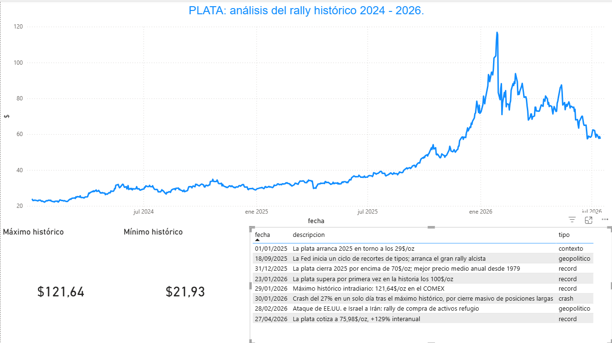

# 🥈 PLATA — Análisis del rally histórico (2024-2026)

Análisis de datos del precio de la plata (XAG/USD) entre enero de 2024 y julio de 2026, periodo que incluye el mayor rally alcista del metal en más de cuatro décadas: desde ~24$/oz hasta un máximo histórico de 121,64$/oz, seguido de una corrección de más del 50%.

Proyecto end-to-end: base de datos relacional en MySQL → consultas SQL de análisis → dashboard interactivo en Power BI.

## 📊 El dashboard



## 🎯 Objetivo

Construir una base de datos desde cero a partir de datos reales de mercado, resolver los problemas típicos de una importación de datos (formato, tipos, NULLs), y responder con SQL a preguntas concretas de análisis financiero:

- ¿Cuál fue el máximo y el mínimo histórico del periodo, y cuándo ocurrieron?
- ¿Cuánto ha corregido el precio desde su máximo (drawdown)?
- ¿Cómo evolucionó el precio mes a mes?

## 🛠️ Herramientas

- **MySQL** — diseño de la base de datos y consultas de análisis
- **Power BI** — dashboard interactivo conectado en vivo a MySQL
- **Fuente de datos**: [Stooq.com](https://stooq.com/q/d/?s=xagusd) (histórico diario XAG/USD)

## 🗂️ Estructura de la base de datos

**`precio_diario`** — histórico diario completo (OHLC)

| Columna | Tipo | Descripción |
|---|---|---|
| id | INT | Clave primaria |
| fecha | DATE | Fecha de cotización (única) |
| apertura | DECIMAL(10,4) | Precio de apertura |
| maximo | DECIMAL(10,4) | Precio máximo del día |
| minimo | DECIMAL(10,4) | Precio mínimo del día |
| cierre | DECIMAL(10,4) | Precio de cierre |

**`eventos`** — hitos clave para dar contexto narrativo al dashboard

| Columna | Tipo | Descripción |
|---|---|---|
| id | INT | Clave primaria |
| fecha | DATE | Fecha del evento |
| descripcion | VARCHAR(255) | Qué ocurrió |
| tipo | VARCHAR(50) | `record` / `crash` / `geopolitico` / `contexto` |

> **Decisión de diseño**: se descartó crear tablas separadas para "máximo histórico" y "mínimo histórico" porque ambos son resultado de una consulta (`MAX()`/`MIN()`) sobre `precio_diario`, no entidades independientes — guardarlos aparte habría duplicado datos ya presentes en la tabla principal.

## 🔍 Consultas SQL destacadas

**Drawdown actual** (caída % desde el máximo histórico), usando subconsultas escalares:

```sql
SELECT
    (
        (SELECT cierre FROM precio_diario ORDER BY fecha DESC LIMIT 1)
        -
        (SELECT maximo FROM precio_diario ORDER BY maximo DESC LIMIT 1)
    )
    /
    (SELECT maximo FROM precio_diario ORDER BY maximo DESC LIMIT 1)
    * 100 AS drawdown_pct;
```

**Cierre de fin de mes**, combinando `GROUP BY` con una subconsulta como filtro:

```sql
SELECT fecha, cierre
FROM precio_diario
WHERE fecha IN (
    SELECT MAX(fecha)
    FROM precio_diario
    GROUP BY YEAR(fecha), MONTH(fecha)
)
ORDER BY fecha;
```

El script completo, con todas las consultas y comentarios, está en [`plata_analisis.sql`](plata_analisis.sql).

## 🚧 Reto técnico: importación de datos con NULLs

Al importar el CSV con el asistente de MySQL Workbench, todas las columnas numéricas se insertaban como `NULL`. La causa: el wizard interpretaba los decimales según la configuración regional del sistema, y no reconocía el punto decimal del CSV (`23.831`).

**Solución aplicada**: importar primero a una tabla `staging` con todas las columnas en texto (`VARCHAR`), donde no hay conversión de tipos que pueda fallar, y después pasar los datos ya convertidos con `CAST()` a la tabla final. Detalle completo en el script SQL.

## 📈 Principales hallazgos

- Máximo histórico: **121,64 $/oz** (29 de enero de 2026)
- Mínimo del periodo: **21,93 $/oz** (22 de enero de 2024)
- Drawdown actual desde el máximo: **-52,5%**
- Cierre de 2025: por encima de 70$/oz, el mejor precio medio anual desde 1979

## 🚀 Cómo reproducirlo

1. Descarga el histórico diario de XAG/USD desde [Stooq](https://stooq.com/q/d/?s=xagusd).
2. Ejecuta `plata_analisis.sql` en MySQL (crea la base de datos, las tablas, y deja las consultas de análisis listas).
3. Conecta Power BI a la base de datos MySQL (`Obtener datos → MySQL database`) y monta las visualizaciones sobre las tablas `precio_diario` y `eventos`.

---

Proyecto de portfolio — Jony, estudiante de Desarrollo de Aplicaciones Multiplataforma (DAM).
